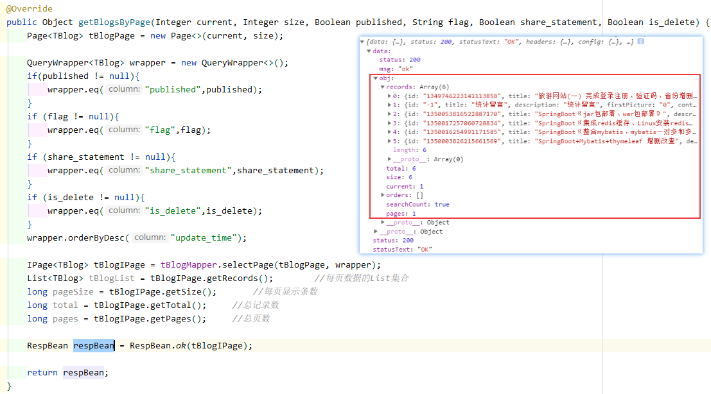

# 星光博客后台管理（2021/10/13）

# 后台Vue

## 编译运行

Project setup

```
npm install
```

Compiles and hot-reloads for development

```
npm run serve
```

Compiles and minifies for production

```
npm run build
```

### 实现功能

- [x] 在线预览
    - [x] 友链url预览（iframe）
    - [x] 博客文章（dialog弹窗---mavon-editor展示博客内容）
- [x] Vue2.6 + element-ui
- [x] mavon-editor文档
- [x] mavon-editor上传图片（结合后端图片上传功能）
- [x] 

# 前台Vue


# SpringBoot后端

技术栈：

- [x] springboot
- [x] mybatis-plus操作数据库
- [x] shiro权限控制
- [x] springboot+redis缓存
- [x] 图片上传

### 分页

返回的`IPage<>`对象包括  records、total、size、current、pages 



